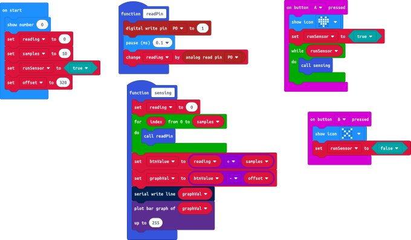

Liquid Level Sensing
====================

There have been a number of posts on Twitter where people have used
BBC micro:bits to measure water levels or soil moisture.

Normally these are done with resistive sensing which has a number of
disadvantages such as corrosion of the sensor.

It seemed like this was a good opportunity to apply my 
[capacitive sensing](./microbit_touch.md) 
learning to a different application area.

If you want some background on how liquid level sensing works with
capacitance then this video is very good:

<iframe width="560" height="315" src="https://www.youtube.com/embed/0du-QU1Q0T4" frameborder="0" allow="accelerometer; encrypted-media; gyroscope; picture-in-picture" allowfullscreen> </iframe>

To create the sensor, two strips of copper tape were stuck onto cardboard
and placed in a freezer bag.
It is important to get the two strips parallel and close as possible
without touching.
The cardboard is placed in a freezer bag to stop it getting wet.
One of the copper strips is connected to ping *GND* and the other
goes to *pin 0*

Here is a video of the initial experiment I did with this:

<iframe width="560" height="315" src="https://www.youtube.com/embed/8eb3Hkf0lko" frameborder="0" allow="accelerometer; encrypted-media; gyroscope; picture-in-picture" allowfullscreen> </iframe>

Using the following code:

This can also be used to measure the change in moisture in a plant pot.
Although maybe the sensor needs to be redesigned a bit to fit into
the ground better.

.. image:: plant_moisture.jpeg

