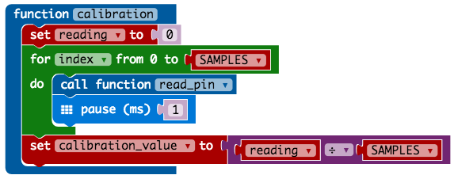

Capacitive Touch With micro:bit
===============================

# Overview

<iframe class="center" width="560" height="315" src="https://www.youtube.com/embed/lO1UFwdejuk" frameborder="0" allowfullscreen></iframe>

I can't pinpoint the exact moment when I started to get curious about including
"home made" capacitive touch sensors in to one of my projects. I suspect it 
was an accumulation of things.

There was that occasion when a student on one of my workshops was fascinated by
a "button" capacitive sensor we were using. They wanted to understand how it
was triggering before their finger actually touched it. This resulted in a great
discussion about electric fields and capacitance.

There is that poster that I walk by regularly showing music technology which 
has a graphic on it that looks like a "play" button. I keep thinking that the 
poster needs to be upgraded so people can press the play button and music
happens.

I regularly read about projects from the team at 
[Bare Conductive](https://www.bareconductive.com/)
featuring painted sensors. This results in my asking lots of questions about 
screen printing to my sister-in-law.

Clearly this idea has been building for a while and at the start of this year 
I ordered some
[Bare Conductive Paint](https://shop.pimoroni.com/products/paint-pen-10ml)
and
[copper tape](https://shop.pimoroni.com/products/copper-tape)
from Pimoroni to take the idea to the next level.

The final piece of the puzzle was a great article from
[About Circuits](https://www.allaboutcircuits.com/technical-articles/circuits-and-techniques-for-implementing-capacitive-touch-sensing/).
explaining how capacitive touch sensors could be done with a single pin on a
modern micro-controller.

# Goal

Capacitive Touch Sensors are not new. I have seen a number of different options
out there for makers that do the job really well so why didn't I go for one of
them?

The short answer is form factor. If I was going to update that poster I needed
something that could be hidden behind the frame of the poster. This constraint
formed the idea that the sensor would be small and battery powered
communicating with something bigger that played the sound.

This drove the decision to experiment with the micro:bit to see if it could do
the capacitive touch sensing.

# Capacitive not Resistive

By default, the micro:bit does support touch but it is resistive touch rather
than capacitive touch. This is described in the
[runtime documentation](https://lancaster-university.github.io/microbit-docs/ubit/io/#overview)
as *"Some pins can also perform basic touch sensing through resistance detection."*

Resistive touch would not work for the poster upgrade idea as you have to 
physically touch the sensor and be connected to the GND pin of the micro:bit.
This is why capacitive sensing is so good. The sensor could be behind the poster
but it would still sense the hand through the poster. It also does not require 
the user to be holding a GND wire.

# Sensing Pin Code

The core functionality of the code is the switching of the pin (P1) between 
being a digital output (with a high value) and an analogue input. 
The capacitance introduce by a hand being present will cause the value read to
be higher.

# Establishing A Reference

We need to calibrate our sensor. We do this by taking a reading when no hand 
is present on the sensor.
We read the value from the sensor a number of times and average the value to
get a more stable value

# Is Touched

This is very similar to the calibration step except that we are compare the 
value we get from the sensor
to the value from the reference value when no hand was present. If the reading 
is higher then we can assume a hand is present.

To make the reading more reliable we add a margin to the reference value.

# Running On Batteries

As you saw in the video at the top of the page, a promising start was made and 
the code seem to be enough to detect a hand about to touch the sensor. 
Readings from the sensor showed good values that clearly crossed the threshold
value that had been set.
The Y value on the chart is the value from the micro:bit ADC which represents
about 225mV peek-to-peek.

When I ran the same experiment with the micro:bit on batteries the values were not as large. In fact they were
tiny coming out at about 9.6mV peek-to-peek. Experimenting with the reference value meant I could
(as in the graph below) get a successful result. However it was not a reliable or predictable result.
There was an issue!

The received wisdom from the people I turned to for help was that it worked 
when the micro:bit was powered by the USB cable via the computer because there
was a route to ground. When on batteries the whole circuit was floating.

Introducing some kind of ground plane into the sensor design seemed to be what
I was being advised. After a few iteration of different designs progress was 
not being made. In frustration I attached crocodile clip from the
GND pin of the micro:bit to copper tape pattern I had been experimenting 
with on the bottom of the box. BINGO!
We were back in business.

While only ~48mV peek-to-peek, it is enough to get a consistent and reliable touch sensor even through a poster.

# Bluetooth Beacons

One of the great things about the micro:bit is it has great Bluetooth support. 
Bluetooth will allow the sensor to communicate back to something like a 
Raspberry Pi about its status.

One project idea would involve having more sensors than the number of Bluetooth 
connections a Raspberry Pi can support. This is only a limitation if you want
the Raspberry Pi to send information back to the sensor.

If the sensor was only to broadcast then the Raspberry Pi could listen for the
status from many sensors. In the code above we change the <code>instance</code> 
value to represent if the sensor is triggered or not.

# Where next

These initial tests have encouraged me to attempt to implement a project with capacitive sensing and a micro:bit.

Exactly what that project will be is still to be decided as it looks like there might be a few issues to
solve still. This means it will not be anything too ambitious (or expensive).

# micro:bit Code

For reference here is the code that was used for these initial tests:

---

&copy; Copyright 2021, Barry Byford.

last updated: 2021 October 31

 This work is licensed under a <a rel="license" href="http://creativecommons.org/licenses/by/4.0/">Creative Commons Attribution 4.0 International License</a>.
