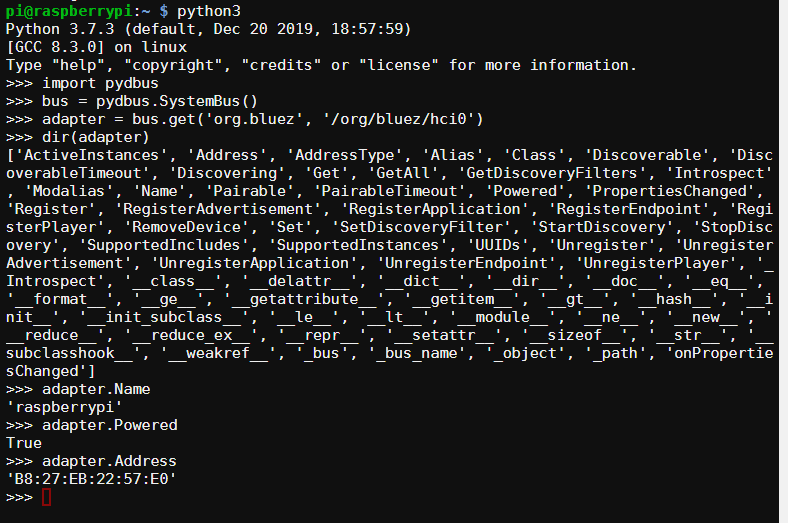

==========================
Using Python For Bluetooth
==========================

Back in 2015 I became aware of Bluetooth BLE Beacons and some of the
things that could be done with them. At the same time I was helping on
a STEM initiative called Go4SET where I would help students build
out ideas of how to solve problems they had observed in the world around them.
Their solution would show how electronics and software could be used to solve
the problems. As Python was the language of choice in the
schools I was working with, I started to investigate how to scan
for BLE Beacons using a Raspberry Pi.

Here we are in 2020 and I still don't have a great solution for
how to do this, but things have got better in that time and I've learnt
some things along the way.
One of the keys things I've learnt is that there is a lot
of out-of-date information on the internet about Bluetooth.
While I suspect my writings will (in time)  add to the volume of out-of-date
information on the internet about Bluetooth. For now I am aiming for it to
be of some help to someone coming to the topic a new.

So here is some Python-Linux-Bluetooth information that might help someone
starting.

Bad Information
===============

Many tutorials on the internet are done with command-line tools that have been
deprecated, such as hcitool and hcidump.
If you see tutorials using the `HCI (Host Controller Interface)
<https://en.wikipedia.org/wiki/List_of_Bluetooth_protocols#HCI>`_ socket
then it is either out-of-date or at such a low level that it is best
to stay away.

The command-line tools recommended by the BlueZ developers are
`bluetoothctl` or, if you need more control, `btmgmt`. And instead of using
`hcidump`, use `btmon`.

I would also be very nervous about using a library that uses `HCI sockets`
for interfacing with the Bluetooth hardware on Linux. More on the different
programming interfaces later.

But BlueZ...Really?
===================

During the years I've been playing around with Bluetooth on Linux I've seen
people show their frustration with the way that BlueZ handles things.

And I see peoples point. An example is that the HCI tools were deprecated and
removed. It is hard to find tutorials on how to use the new tools and answers
to `questions on the mailing list
<https://www.spinics.net/lists/linux-bluetooth/msg70489.html>`_ expect a
certain level of knowledge. It is also common for questions to go unanswered
on the mailing list. This is Open Source so they don't owe anyone an answer.
However, I have also seen the developers show their frustration that people
go off and do crazy things rather than how they had intended things to work.

I spent many years of my professional life as an Application Engineer for
a software company. My big learning from that time is that if you don't show
people how to use your tool (and make using it the way you wanted the easiest)
then smart people will workout their own way of doing it.

Having said all of that, the developers have settled on the DBus API and
it is getting better and better. The biggest barrier for most people is
finding the "on-ramp" to learning about how to use it.

There are examples `Python examples
<https://git.kernel.org/pub/scm/bluetooth/bluez.git/tree/test/test-profile>`_
in the repository, but frankly they are often of limited value.

BlueZ API
=========

A list of the possible API's starting from lowest level and going to the
highest. For most people, the higher the better.

HCI Socket
----------

As I said earlier, this bypasses the `bluetoothd` that is running on the
Linux system that is used by the desktop tools. Using this is not a great
idea unless you really, really know what you are doing.

All the information is available in the Bluetooth `Core Specification
<https://www.bluetooth.com/specifications/bluetooth-core-specification/>`_
which runs to about 3,256 pages for the 5.2 version of the spec.

MGMT Socket
-----------

The BlueZ `Bluetooth Mamagement API
<https://git.kernel.org/pub/scm/bluetooth/bluez.git/tree/doc/mgmt-api.txt>`_
is the next step up and the lowest level that the BlueZ developer recommend.

The problem for Python users is `this bug <https://bugs.python.org/issue36132>`_
makes it difficult to access the mgmt socket. There are other duplicate bugs
on this in the system. Until they are fixed, this remains off bounds for many
Python users.

DBus API
--------

This should be the go to level for most people wanting to interact with the
BlueZ API's. However, it seems the number of people that have done things
with DBus previously is a relatively small group and it is another
level of indirection to learn.

There are a number of Python libraries that offer
`DBus bindings <https://www.freedesktop.org/wiki/Software/DBusBindings/>`_
for Python.
However, there isn't just one library that is correct for all cases.
`pydbus <https://pypi.org/project/pydbus/>`_ is one of the easier ones to get
started with.

The BlueZ DBus API for interacting with the Bluetooth Adapter on your
Raspberry Pi is documented at
https://git.kernel.org/pub/scm/bluetooth/bluez.git/tree/doc/adapter-api.txt

This allows you to know that the DBus Service is (`org.bluez`). The Object Path
is less obvious from the documentation but is `/org/bluez/hci0` by default
on most Linux machines.
With this information we can quickly look to see properties from the adapter
using Python. The example below looks at name, if it is powered, and its
mac adderess:

Python For Bluetooth
====================

If you write applications on iOS or Android, then you will have seen
there are some great libraries with API's that hide much of the
gnarly-ness of Bluetooth.
With Python there are not those libraries around with that level of
abstraction for most things you might want to do.
So you might end up going a little deeper and needing to know some of the
details of Bluetooth.

Libraries to help you Bluetooth
===============================

There are plenty of them out there. I keep a list of many of them at:
https://github.com/ukBaz/python-bluezero/wiki

Most of them are pretty niche in what they do. There are a number of them that
are abondonware. This isn't surprising given how big Bluetooth is and the many
things you can do with it.

It is also really hard to automate the testing of Python Bluetooth libraries
and I think this is what ends up being the main reason why the libraries stay
niche or abandoned.

More than one Bluetooth
=======================

Depending on where you are starting from there can be a number of
details that can trip people up when they first engage with Bluetooth
and code.

The first is that there are two different types of Bluetooth.
These are generally referred to as Classic and BLE. Devices like the
Raspberry Pi support both. While the BBC micro:bit is BLE only.
If you try to use Classic (aka BR/EDR, aka rfcomm,
aka Serial port profile, aka spp, aka 1101,
aka 00001101-0000-1000-8000-00805f9b34fb) on the Raspberry Pi then
it will never speak sensibly with a micro:bit.

Bluetooth Classic (BR/EDR) supports speeds up to about 24Mbps.
It was version 4.0 of the standard that introduced a low energy mode,
Bluetooth Low Energy (BLE or LE, also known as “Bluetooth Smart”),
that operates at 1Mbps. This mode allows devices to leave their
transmitters off most of the time. As a result it is “Low Energy”.

These two modes have a different philosophy of how they behave. Classic
is a cable replacement. It makes the connection and stays connected.
BLE is similar to a database where the transmitter is only on when it is being
written to or read from. Clients can also subscribe to notifications when
data changes in the Generic ATTribute Profile (GATT).

.. image:: two_bluetooth_types.jpeg

In classic mode there is a server and a client. The server advertises and the
client connects.

With BLE there are different terms of peripheral and central. A peripheral
advertises and a central scans and connects.

In BLE you can also have a Broadcaster (beacon) which is a transmitter only
(connectionless) application. The Observer (scanner) role is for receiver only
connectionless applications.

Endianness
==========

As with most communication protocols, data is chopped up in to bytes
that are sent between the two devices.
When this is done there is a choice of what order those bytes are
transmitted in.
This is referred to as `endianness <https://en.wikipedia.org/wiki/Endianness>`_

The Bluetooth standard is little-endian which often trips people up that are
looking at Bluetooth for the first time.

The exception to this is when looking at beacons. As far as I can tell this
seems to be because Apple did this when they brought out the iBeacon and many
have followed that example.

Binary
======

Because Bluetooth has come out of the embedded world there are lots of binary
numbers referring to things rather than nice string names. Lots of values are
128-bits in length.

This means that when I want to look at the status of button A on a micro:bit
I need to look in the GATT database for `E95DDA90-251D-470A-A062-FA1922DFA9A8`

In classic mode, the `Serial Port Profile
<https://www.bluetooth.com/specifications/assigned-numbers/service-discovery/>`_
(SPP) is normally referred to by the 16-bit hex value of `0x1101`.
However, it is really an 128-bit value but because it is an official profile
it can be shortened to a 16-bit value

Bluetooth Special Interest Group (SIG) Reserved Values
------------------------------------------------------

The SIG has the following number reserved and the `xxxx` below is replaced
with the 16-bit value.
`0000xxxx-0000-1000-8000-00805f9b34fb`

If you see a tutorial that is using 16-bit values without using official SIG
profiles then be suspicious if that is a good tutorial.

Asynchronous
============

There are parts of Bluetooth that just needs to be asynchronous. Examples are
when scanning for new devices or getting notifications from a peripheral.
While this is possible to do with Python, asynchronous isn't the way most
people learn Python.

For BlueZ, it works with the GLib event loop which will be familiar to
people that have coded GUI's in Python.

Pairing and Connecting
======================

I have seen confusion between these two terms when people come to programming
Bluetooth.

Pairing is about the two devices exchanging information so that the
devices can communicate securely. So pairing is a one-off activity to
exchange credentials. It is not always required as sometimes it is OK for
devices to exchange information without being secure. Especially if you are
just learning as it simplifies the processes involved.

Connection needs to be done every time you want the devices to start
communicating. It is a straight forward step in the two devices already know
about each other.

I typically recommend that the one-off setup of scanning and pairing is done
manually with `bluetoothctl`.

RFCOMM (Or is that SPP?)
========================

This is the most useful profile in classic mode for many activities in the
maker community when you want ot exchange information between two boards
that support Bluetooth serial connection. From Python 3.3 this is supported
within the standard socket library. Below is an example of a client connecting
to a server. This assumes the pairing has already happened and will do the
connection.

>>> import socket
>>> s = socket.socket(socket.AF_BLUETOOTH, socket.SOCK_STREAM, socket.BTPROTO_RFCOMM)
>>> s.connect(('B8:27:EB:22:57:E0', 1))
>>> s.send(b'Hello')
>>> s.recv(1024)
b'world'
>>> s.close()

If this just works then life is great. If there are issues, then this is when
Bluetooth can become more frustating. Debugging is probably a separate post.

BLE (Or is that GATT)
=====================

With BLE there is not the same level of support from native Python so it
is required to use the DBus API. This means using the
`Device <https://git.kernel.org/pub/scm/bluetooth/bluez.git/tree/doc/device-api.txt>`_
and
`GATT <https://git.kernel.org/pub/scm/bluetooth/bluez.git/tree/doc/gatt-api.txt>`_.

The difficult piece with these is that it is not known ahead of connection
what the DBus `Object Path` will be for the devices, GATT Services,
and GATT Characteristics we are interested in.

This results in the need to do a reverse look-up from the UUID to the
object path. This was the subject of a
`kata <https://github.com/campug/bzero_kata>`_
I held at my local Python user group.

Good To Know
============

This talk at Embedded Linux Conference gave lots of good insight in to how
things are done with BlueZ. It is worth a watch if you are interested in
learning more.

.. raw:: html

    <iframe width="560" height="315"
        src="https://www.youtube.com/embed/VMDyebKT5c4"
        frameborder="0" allow="accelerometer;
        autoplay; encrypted-media; gyroscope; picture-in-picture"
        allowfullscreen>
    </iframe>

Python, Bluetooth, and Windows...
=================================

In Python 3.9 it is going to be easier to use Bluetooth RFCOMM (Serial Port
Profile) thanks to this submission: https://bugs.python.org/issue36590